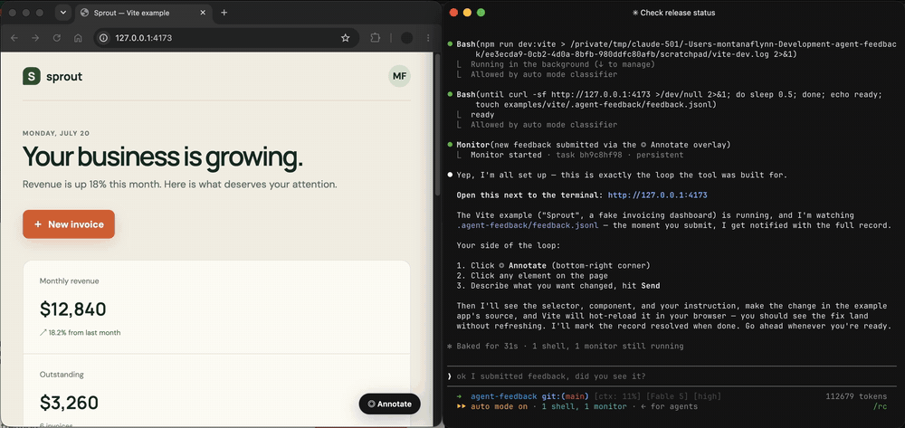

<h1 align="center">Agent Feedback</h1>

<p align="center">
  <strong>Leave comments on your live app. Your coding agent resolves them.</strong>
</p>

<p align="center">
  <a href="https://github.com/montanaflynn/agent-feedback/actions/workflows/ci.yml"></a>
  <a href="https://www.npmjs.com/package/@agent-feedback/cli"></a>
  <a href="LICENSE"></a>
  <a href="#install"></a>
</p>

<p align="center">
  <a href="#quickstart">Quickstart</a> ·
  <a href="#install">Install</a> ·
  <a href="#what-the-agent-sees">What the agent sees</a> ·
  <a href="#http-api">HTTP API</a> ·
  <a href="#develop">Develop</a>
</p>

---



## Why Agent Feedback exists

Point, don't describe.

Explaining a UI change to a coding agent in prose is slow and lossy — "the third card in the pricing grid, no, the *button* under the title" takes longer to type than the fix. Meanwhile the exact selector, component name, and page URL are sitting right there in the DOM.

Agent Feedback adds a development-only **◎ Annotate** overlay to your app. Click an element, say what you want, and a structured record — selector, component, page, instruction — lands in your dev server's stdout, where an agent is already watching. No screenshots, no copy-pasted selectors, no hand-written prompt.

Everything is local. Feedback lives in `.agent-feedback/feedback.jsonl` and your development server logs; there is no hosted service, no account, and nothing ships in production builds.

## Quickstart

From an app using Vite or the Next.js App Router:

```sh
npx @agent-feedback/cli@latest install
```

Restart your dev server, then:

1. Click **◎ Annotate** (bottom-right, development only)
2. Hover and click an element
3. Describe the change and press **Send**

Nested elements normalize to an interactive ancestor — selecting a `span` inside a button targets the button. The installer also drops a `run-agent-feedback` skill into your project so your agent knows to keep the dev server attached, watch for feedback, implement each request, and mark it resolved:

```text
Use $run-agent-feedback to launch the app and respond to visual feedback.
```

To try it without your own app, this repo ships complete examples — see [Develop](#develop).

## What the agent sees

Each accepted request gets an `af_` ID and a `pending` status, appended to `.agent-feedback/feedback.jsonl`:

```json
{"id":"af_a1b2c3","status":"pending","createdAt":"2026-07-20T15:00:00.000Z","instruction":"Use the secondary button style.","page":{"url":"http://localhost:3000/pricing","title":"Pricing"},"target":{"selector":"[data-testid=\"trial\"]","tag":"button","text":"Start trial","role":"button"},"metadata":{"framework":"react","component":"PricingCard","hierarchy":["PricingPage","PricingCard"]}}
```

The dev server also prints a recognizable block, so an agent tailing the process needs zero integration:

```text
[agent-feedback:new]

id: af_a1b2c3

page:
/pricing

target:
button "Start trial"

instruction:
Use the secondary button style.

[/agent-feedback:new]
```

With `@agent-feedback/react` installed, records include the component name and hierarchy from React's development metadata.

## Install

```sh
npx @agent-feedback/cli@latest install
```

The installer detects your framework and package manager, installs the relevant integration, updates the framework configuration, adds `.agent-feedback/` to `.gitignore`, and installs the agent workflow in every detected agent location:

- `.claude/skills/run-agent-feedback/SKILL.md` when Claude is detected
- `.agents/skills/run-agent-feedback/SKILL.md` when Codex, Cursor, or OpenCode is detected — and as the portable fallback when no agent is detected

Detection checks project and home configuration directories plus executables on `PATH`; the skill is always written to the project. `init` is an alias for `install`. Use `--no-skill` to configure only the runtime, or `npx @agent-feedback/cli skill` to install or inspect only the skill (existing customized skills are preserved; `--force` restores the packaged version).

<details>
<summary><strong>Manual setup — Vite</strong></summary>

```sh
npm install --save-dev @agent-feedback/vite
```

For a React application, also install `@agent-feedback/react`, then add the plugin:

```ts
import { defineConfig } from "vite";
import { agentFeedback } from "@agent-feedback/vite";

export default defineConfig({
  plugins: [agentFeedback({ react: true })]
});
```

Omit `{ react: true }` for Vue, Svelte, Solid, Preact, or plain HTML. Element selection and submission still work; only React component metadata is omitted.

</details>

<details>
<summary><strong>Manual setup — Next.js App Router</strong></summary>

```sh
npm install --save-dev @agent-feedback/next
```

Render the development-only client in the root layout:

```tsx
import { AgentFeedback } from "@agent-feedback/next";

export default function RootLayout({ children }: { children: React.ReactNode }) {
  return (
    <html lang="en">
      <body>
        {children}
        <AgentFeedback />
      </body>
    </html>
  );
}
```

Create `app/%5F_agent-feedback/route.ts` (or the equivalent under `src/app`). Next.js decodes the escaped leading underscore, so the public URL remains `/__agent-feedback`:

```ts
export { POST } from "@agent-feedback/next/route";
```

Also create `app/%5F_agent-feedback/[id]/route.ts`:

```ts
export { PATCH } from "@agent-feedback/next/resolve";
```

Both the overlay and routes return `404` or render nothing in production.

</details>

### Update

```sh
npx @agent-feedback/cli@latest update
```

Installs the latest integration packages, re-runs the idempotent framework setup, and refreshes every project-local skill copy. Unlike the conservative `skill` command, `update` deliberately replaces an outdated or customized workflow — differing copies are first saved under `.agent-feedback/backups/`. Use `--no-install` to skip dependency changes, `--no-skill` to keep workflows untouched, or pin a version (`npx @agent-feedback/cli@0.1.0 update`) for a staged rollout.

### Uninstall

```sh
npx @agent-feedback/cli@latest uninstall
```

Removes the framework wiring, the `@agent-feedback/*` packages, and both possible skill copies — backing up customized files under `.agent-feedback/backups/` first. Feedback history, backups, and the `.gitignore` entry are preserved to avoid destructive data deletion. Use `--keep-packages` or `--keep-skill` for a partial uninstall.

Restart the development server after any lifecycle operation.

## HTTP API

`POST /__agent-feedback` accepts:

```json
{
  "instruction": "Use the secondary button style.",
  "page": { "url": "http://localhost:3000/pricing", "title": "Pricing" },
  "target": {
    "selector": "[data-testid=\"trial\"]",
    "tag": "button",
    "text": "Start trial",
    "role": "button"
  },
  "metadata": {}
}
```

and responds `201`:

```json
{ "id": "af_a1b2c3", "status": "pending" }
```

`PATCH /__agent-feedback/:id` appends a resolution event and returns:

```json
{ "id": "af_a1b2c3", "status": "resolved" }
```

Resolution is driven by the agent through this endpoint; the browser UI does not expose resolution controls.

## Develop

Requires Node.js 20+.

```sh
npm install
npm run check
```

The workspace packages:

| Package | What it is |
| --- | --- |
| `@agent-feedback/core` | Overlay, selectors, HTTP client, broker, persistence |
| `@agent-feedback/react` | Optional React Fiber metadata |
| `@agent-feedback/vite` | Vite HTML injection and HTTP middleware |
| `@agent-feedback/next` | App Router client and route handlers |
| `@agent-feedback/cli` | Project installer CLI |

Two complete example apps are included — `npm run dev:vite` (<http://127.0.0.1:4173>) and `npm run dev:next` (<http://127.0.0.1:4174>). To try the intended continuous loop, invoke the repo-local skill:

```text
Use $run-agent-feedback to launch the Vite example and respond to visual feedback.
```

See the [examples guide](examples/README.md) for both commands and [Architecture](docs/architecture.md) for boundaries and design decisions.
